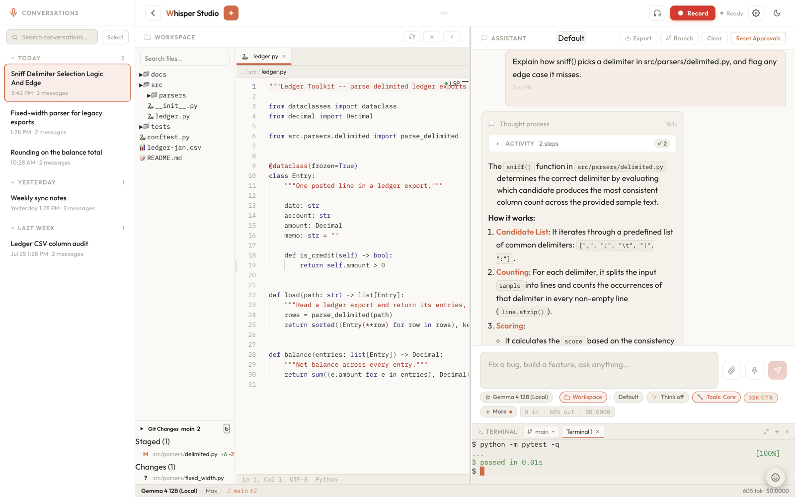
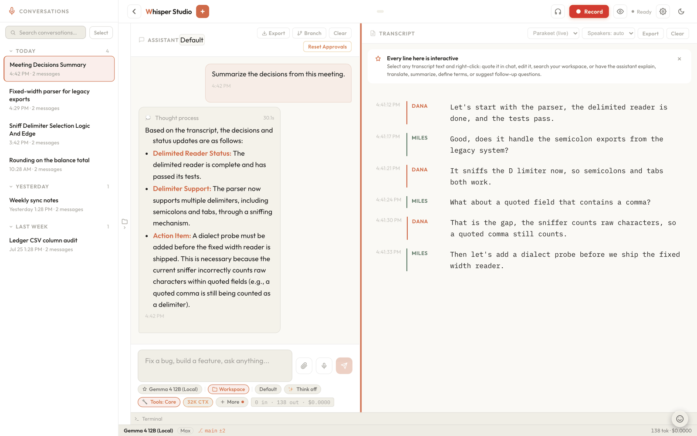
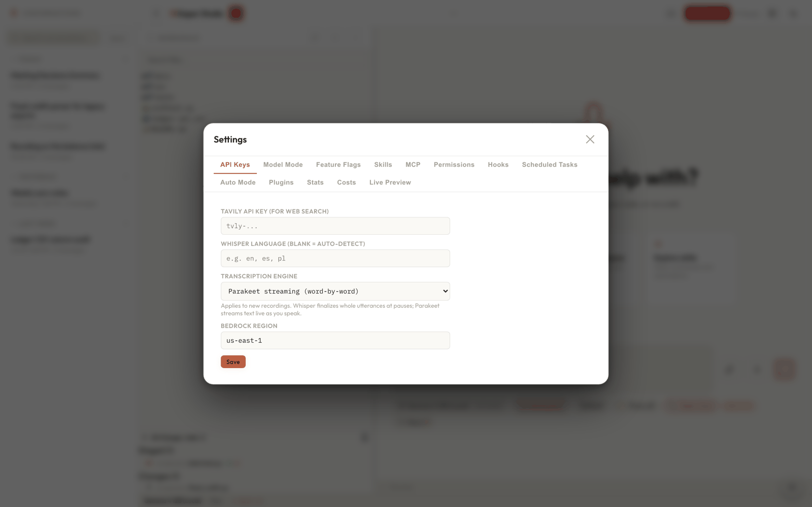
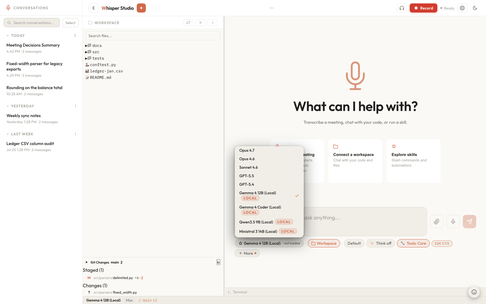
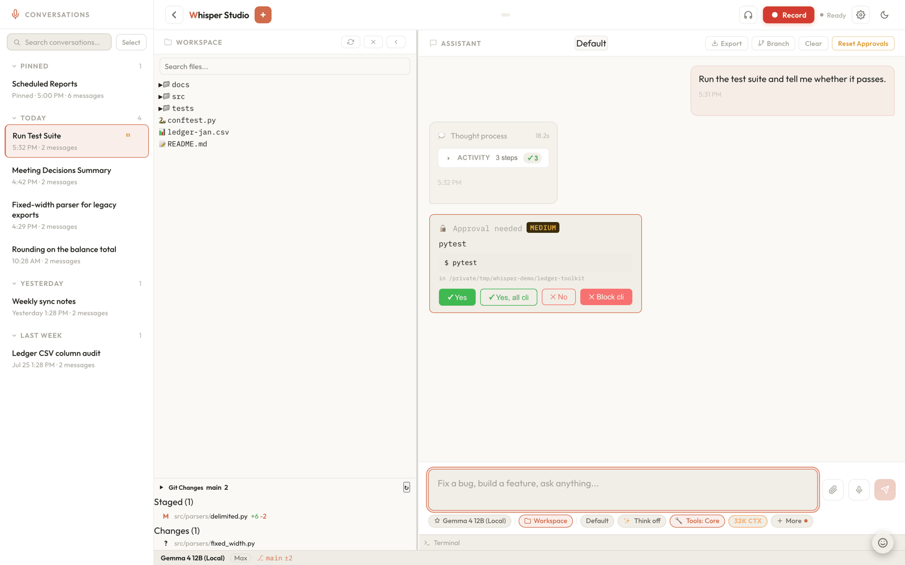

# Whisper Studio

**A native Mac app.** Download it, drag it into Applications, open it.
That is the whole install (see [Quick start](#quick-start)). Whisper Studio
is a local-first AI workspace for macOS: real-time speech transcription, a
chat client to Claude or GPT (via Amazon Bedrock) or an on-device model in
local mode, a spoken voice mode, and a full development environment (file
tree, Monaco editor, integrated terminal, Git, LSP) in a single browser tab
served by a single local process.



*The Mac app on first launch. Chat, live transcription, and a full
development environment (file tree, Monaco editor, terminal, Git, LSP) live
behind that one composer.*

> **Transcription runs entirely on your machine.** The speech model
> loads into memory on first record and runs locally on CPU/GPU. Recorded
> audio never leaves the laptop. Amazon Bedrock is used only for a cloud
> chat response (Claude or GPT) you explicitly send; pick an on-device model
> instead and no chat call leaves the machine either. The one exception is
> voice mode: while you hold a spoken conversation, that audio is streamed
> to Amazon Nova Sonic on Bedrock. No telemetry, no proxies, no per-minute
> transcription fees.

## Documentation

Read the docs online at **[paukode.github.io/whisper-studio](https://paukode.github.io/whisper-studio/)**,
published to GitHub Pages automatically on every push to `main`. The same
site ships inside the app: open the **?** panel, or ground an answer in it
with `@docs`.

The docs are a self-contained static site in **[`docs/`](docs/)** (no build
step, zero external network calls), so you can also browse them locally:

```sh
cd docs && python3 -m http.server 8123
# open http://127.0.0.1:8123
```

Deploy setup is in [`docs/README.md`](docs/README.md).

| If you want to… | Read |
|---|---|
| Install from scratch (zero prior tooling) | [Installation](https://paukode.github.io/whisper-studio/installation.html) · [Requirements](https://paukode.github.io/whisper-studio/requirements.html) |
| Configure region, model, keys, feature flags | [Configuration](https://paukode.github.io/whisper-studio/configuration.html) · [Env vars](https://paukode.github.io/whisper-studio/ref-env.html) · [Settings keys](https://paukode.github.io/whisper-studio/ref-settings.html) |
| Learn a task (chat, voice, docs, research, coding, cron) | [Tutorials](https://paukode.github.io/whisper-studio/tut-first-chat.html) |
| Talk to the assistant out loud | [Talk: voice conversations](https://paukode.github.io/whisper-studio/tut-voice-mode.html) |
| Record mic, a Chrome tab, or system audio for meetings | [Voice & meetings](https://paukode.github.io/whisper-studio/tut-voice.html) |
| Run parallel agents and read what they found | [Sub-agents & teams](https://paukode.github.io/whisper-studio/tut-subagents.html) · [Agent flight recorder](https://paukode.github.io/whisper-studio/arch-agent-recorder.html) |
| Review a repo with a background agent swarm | [Ultracode](ULTRACODE.md) |
| Look up a slash command or agent tool | [Slash commands](https://paukode.github.io/whisper-studio/ref-slash-commands.html) · [Agent tools](https://paukode.github.io/whisper-studio/ref-tools.html) |
| Understand the internals | [Architecture](https://paukode.github.io/whisper-studio/arch-overview.html) |
| Understand the security model | [Security](https://paukode.github.io/whisper-studio/ref-security.html) |
| Hack on the code | [Development & contributing](https://paukode.github.io/whisper-studio/contributing.html) |

## Highlights

- **Single-origin local app.** FastAPI serves the REST/SSE/WebSocket API
  and the React SPA on one local port. No CORS, no separate frontend host,
  no remote backend.
- **Local transcription with speaker attribution.** Two on-device engines
  (Parakeet streaming, Whisper batch) plus Canary, word-level timings,
  turns split where one speaker takes over, and voiceprints that recognise
  a named speaker in later recordings.
- **Talk to it.** Voice mode holds a spoken conversation: Amazon Nova Sonic
  carries the voice while your session's model does the work through the
  same tools as typed chat, approvals included.
- **Chat with Claude or GPT.** Fable 5.0/5.1, Opus 4.6/4.7/4.8/5, Sonnet
  4.6/5, Haiku 4.5, GPT-5.4/5.5, GPT-5.6 Sol/Terra/Luna and GPT-6 Astra,
  with streaming tokens, tool use, attachments and slash commands. Or run
  fully on-device in local mode.
- **Full workspace IDE.** File tree, Monaco editor, xterm.js terminal, Git
  (status, diff, log, blame, branches, fetch, pull, PR), LSP for Python and
  TypeScript, ripgrep search.
- **Agents that report back.** Every agent run is recorded on disk as it
  happens, ends with a written report inside its budget, and survives a
  stop or a restart. When agents finish with no turn to read them, the
  assistant picks up their reports and answers on its own.
- **Search every past session.** Full-text search across conversations and
  transcripts, from the sidebar or from the assistant, with no model call.
- **Skills it maintains itself.** Built-in and custom Markdown skills, plus
  a post-turn review that turns your corrections and repeated workflows
  into skills and memories.
- **Extensible.** Cloud, hybrid and local model modes, MCP servers, opt-in
  Python plugins, and scheduled jobs whose output streams back into the
  originating chat.
- **Persistent sessions** in SQLite (WAL), with user files under `~/.whisper`.



*Live transcription with diarization. Speakers are separated automatically and
renamed by clicking the label; the assistant on the left summarised the
transcript without it ever leaving the machine.*

More screenshots, one per feature, are in the
**[tutorials](https://paukode.github.io/whisper-studio/tut-first-chat.html)**.

## Quick start

**Mac app (recommended, Apple Silicon, macOS 14+):** download the latest DMG
from the **[Releases page](https://github.com/paukode/whisper-studio/releases)**,
drag it into Applications, then right-click and choose Open on first launch
(the build is not notarized). No Homebrew, Python, or cloning required.

**From source**, if you already have Python 3.12+, Homebrew, Git, and the AWS CLI configured:

```sh
git clone https://github.com/paukode/whisper-studio.git
cd whisper-studio
bash setup.sh
```

`setup.sh` provisions an isolated `venv/`, installs Node into it via
`nodeenv`, fetches frontend deps, builds the bundle, downloads the same
always-on speech models the Mac app ships, seeds the same first-run config
the Mac app creates, then serves the app on a single port and opens it in
your browser. Click the gear icon to set your **Bedrock Region**:



Pick the model from the **model chip** in the composer toolbar rather than in
Settings, since cloud and on-device models sit in the same list:



Then type "hello" in chat. If the model responds, you are done. Transcription
needs no setup; the transcription engine downloads on first record.

For the Vite dev server with hot-module reload, use `bash setup.sh --dev`.

New to Python / Homebrew / AWS, or want the setup flags and model modes?
The **[Installation guide](https://paukode.github.io/whisper-studio/installation.html)** walks through
everything from zero, including what a source install shares with the Mac app
and where the two differ.

## Updating

Already running Whisper Studio? No need to re-clone. From the repo folder:

```sh
git fetch origin
git reset --hard origin/main
bash setup.sh          # rebuild the bundle and install any new deps
```

Your settings, chat history, and downloaded models live in gitignored folders
(`config.user.json` and the legacy `config.json`, `storage/`, `data/`,
`models/`), so this updates only the code and leaves them untouched.

> **Heads up:** `git reset --hard` discards any local changes to *project files*
> (not your config or data), so commit or `git stash` them first if you have
> edited the code. And never run `git clean` here: it would delete the
> gitignored config, `models/`, and `storage/` you want to keep.

## Configuration

Settings resolve in layers, highest priority first: environment
(`TAVILY_API_KEY`, `HOST`, `PORT`), project
(`<workspace>/.whisper/settings.json`), user (`config.user.json` at the repo
root, or the legacy `config.json`, both gitignored), and the shipped system
layer (`config.example.json` merged over built-in defaults). The project and
user layers are edited through the in-app Settings panel (gear icon); the env
layer is shell-only.

On first run `setup.sh` creates `config.user.json` with the same defaults a
fresh Mac-app install gets: hybrid model mode, on-device index capabilities,
and every weight downloading on demand. Chat, transcription, and the workspace
tools all work out of the box; web search needs a Tavily key, and voice mode
needs Amazon Nova Sonic access in your Bedrock region. Full field-by-field
tables are in
**[Configuration](https://paukode.github.io/whisper-studio/configuration.html)**,
**[Environment variables](https://paukode.github.io/whisper-studio/ref-env.html)**, and
**[Settings & config keys](https://paukode.github.io/whisper-studio/ref-settings.html)**.

### Adding an on-device model

On-device models are declared entirely in config, with no code change. Add one
entry to `chat_models` in your user config carrying both the picker fields and
the weights:

```json
"local_llama4": {
  "id": "local:llama-4-8b",
  "label": "Llama 4 8B (Local)",
  "is_local": true,
  "supports_thinking": true,
  "supports_tools": true,
  "repo_id": "some-org/Llama-4-8B-Instruct-GGUF",
  "filename": "Llama-4-8B-Instruct-Q4_K_M.gguf",
  "dir": "llama-4-8b",
  "ctx": 32768
}
```

`repo_id`, `filename` and `dir` are required for a GGUF entry (an MLX entry
takes `"engine": "mlx"` and needs no `filename`); an entry missing them is
skipped with a warning. `ctx` defaults to 32768, which is what the full tool
pool needs. The model appears in the picker right away, and its weights
download the first time you select it, with no `setup.sh` run needed. Most
people never edit config for this: **Settings > Models > Discover** installs a
curated set in one click.

Tool calling and the thinking channel come from `llama-server`, which uses
each model's own chat template and upstream's per-family parsers, so a new
family works without app changes. `setup.sh` installs it (Homebrew on macOS);
build 10090 or newer is required for current architectures.

## Usage

Type `/` in the chat input for slash commands, `@file:path` to pull a file
into the prompt, `@docs` to ground an answer in the documentation, and the
microphone icon to dictate (say "okay send", "send now", "fire away", or
"send the message" to submit hands-free; a bare "send" never fires). You can
send another message while the assistant is working, and it is folded into
the running turn. When a workspace is connected, the assistant can read and
edit files, run sandboxed commands, use Git, search the web, remember things
across sessions, schedule jobs, and spawn sub-agents, all gated by the
current permission mode.

Each of these has a tutorial or reference page:

- **[Tutorials](https://paukode.github.io/whisper-studio/tut-first-chat.html)**: first chat, voice
  conversations, meetings and dictation, documents, web research, the
  workspace IDE, permissions, memory & WHISPER.md, skills, sub-agents, cron,
  indexing & search, MCP & plugins, and model modes.
- **[Slash commands](https://paukode.github.io/whisper-studio/ref-slash-commands.html)** and
  **[Agent tools](https://paukode.github.io/whisper-studio/ref-tools.html)**: the complete reference for
  every `/` command and the full tool pool the assistant can call (120 core
  tools plus skill-backed and MCP tools).

## Security model

Whisper Studio binds `127.0.0.1` by default, sanitizes every Markdown
render through DOMPurify before it reaches the DOM, routes risky commands
through a server-held approval pause that re-validates the action at
execute time, and wraps shell and Python execution in `sandbox-exec(5)`.
HTTPS is verified against the macOS trust store as well as the bundled
certificate list. Plugins are opt-in, credentials are scrubbed from MCP
child processes, and the outbound calls the backend makes on its own are to
Amazon Bedrock for a cloud chat model or a voice conversation, both skipped
entirely in local mode. No telemetry.

In the default permission mode, every command the assistant wants to run stops
for approval first, showing the exact command, its working directory, and a
risk rating:



Full boundary table: **[Security model](https://paukode.github.io/whisper-studio/ref-security.html)**,
with the deeper rationale in
[Overall system § Security boundaries](https://paukode.github.io/whisper-studio/overall-system.html#security-boundaries).

## Development

```sh
venv/bin/python -m pytest tests/      # backend unit + smoke tests
venv/bin/ruff check . && venv/bin/ruff format --check .
npx tsc --noEmit     # types
npm test             # vitest frontend tests
npm run lint         # ESLint
npm run build        # tsc -b + vite build
```

Ruff lint and format are a blocking CI gate. The project layout, conventions
(backend restart, tool wiring, approval flow, the 1200-line file-size budget),
and full tech stack are documented in
**[Development & contributing](https://paukode.github.io/whisper-studio/contributing.html)**,
with the repository's own working agreement in [CLAUDE.md](CLAUDE.md).

## License

MIT License. See [LICENSE](LICENSE) for the exact terms.

## Disclaimer

Whisper Studio is an independent, community project. It is not affiliated with,
endorsed by, sponsored by, or certified by Amazon, Anthropic, OpenAI, Google, or
any other company whose products or services it can connect to.

All product names, brands, and model names referenced in this project are the
property of their respective owners:

- Amazon, AWS, Amazon Bedrock, and Amazon Nova are trademarks of Amazon.com, Inc. or its affiliates.
- Claude is a trademark of Anthropic.
- GPT and ChatGPT are trademarks of OpenAI.
- Gemma is a trademark of Google LLC.

These names are used here only for identification and interoperability, to
describe the third-party services and models that Whisper Studio can connect to.
Their use does not imply any affiliation with, or endorsement by, the trademark
owners.

Whisper Studio is built independently, using publicly available knowledge,
documentation, and APIs. It does not use or rely on any confidential,
proprietary, or non-public information belonging to any of these companies.

Whisper Studio does not include, host, redistribute, or grant any rights to these
models, services, or their weights. You access them through your own accounts and
credentials, and your use of each is governed by that provider's own terms of
service and pricing. Cloud models are paid services billed to your own account per
use; running in on-device (local) mode makes no cloud calls. Model names and
availability are described as of this writing and may change without notice.

The software itself is provided "as is", without warranty of any kind, under the
terms of the MIT License in [LICENSE](LICENSE).
